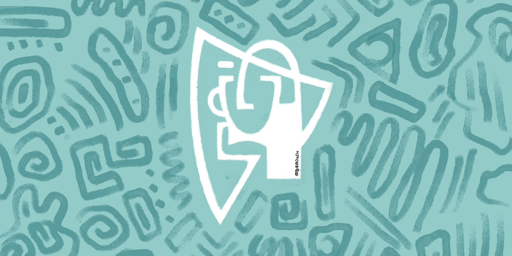
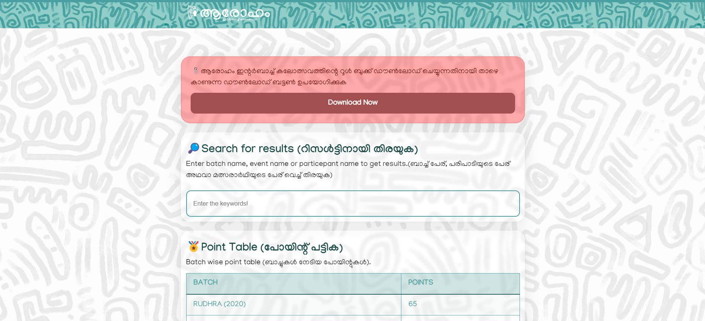
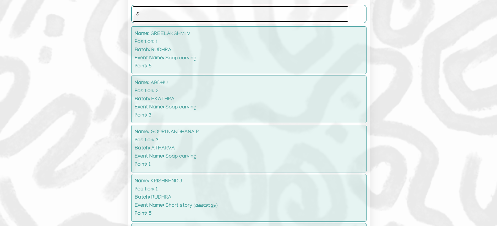
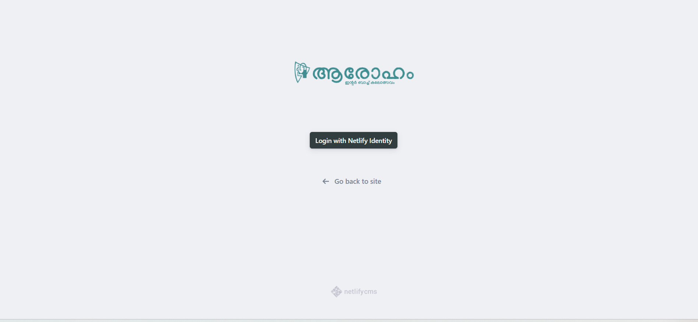
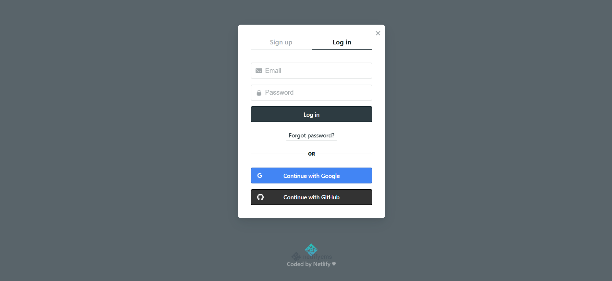
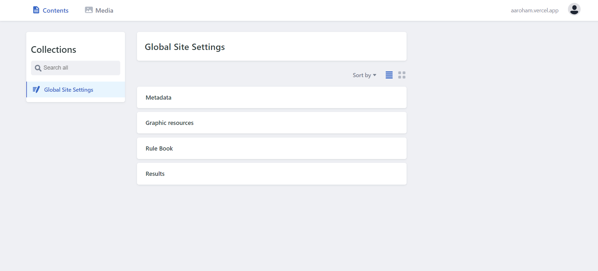

<h2 align="center"><u>Aaroham ~ Interbatch Arts</u></h2>

<h4 align="center"> Generate beautiful Repository Readme </h4>

    
    
    
    
    
 
    
    
    
    
    
 
    

### [+] Description
ഗോകുലം ഇനി സാക്ഷിയാകുന്നത് കലകളുടെ മാറ്റുരയ്ക്കലിനാണ്. കനലെരിയുന്ന ചിന്തകളും താളാത്മകമായ നൃത്തസംഗീതങ്ങളും ക്രിയാത്മകതയുടെ മായാജാലങ്ങളും അരങ്ങേറുകയാണ്. ഇനി അവരോഹണങ്ങളില്ല. നവോത്ഥാൻ 23-24 അവതരിപ്പിക്കുന്നു 'ആരോഹം'

### [+] Installation
 - `Pre installed Jekyll needed.`
 - `Run "bundle install" or "bundle update"`
 - `After bundle install; run "bundle exec jekyll serve" for get it on localhost.`
 - `Use "Netlify" or "Vercel" for production deploy.`

### [+] Usage
 - `For login screen, navigate to "https://localhost/admin" or "https://example.com/admin"`
 - `Sign Up/Login for Netlify identity. Change the parameters under "Global Site Settings".`
 - `Save and Publish changes.`
 - `⚠️Important: Read the hints below each and every inputs.`

### [+] Screenshot

### [+] Features
 - Modern user interface & minimal code
 - .csv search enabled.
 - Made with static site generator ~ Jekyll.
 - Decap CMS enabled

### [+] Credits 
<a href="https://github.com/muhashfar/Aaroham">muhashfar</a>

### [+] Find me on 

